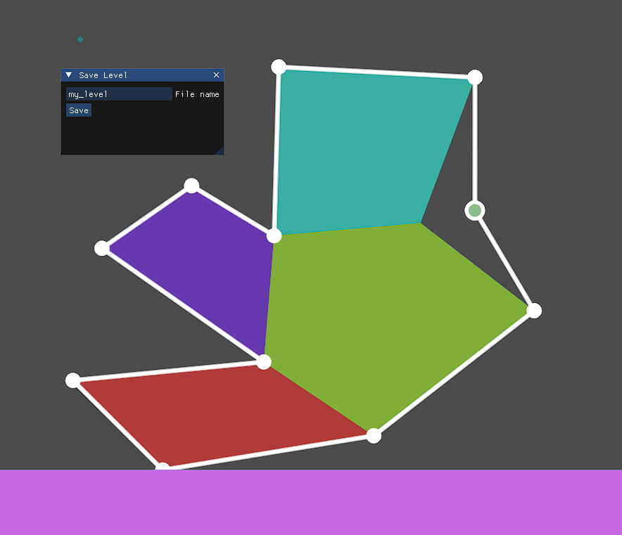

<h1 align="center">Godot UGC</h1>
A WIP user-generated content game example made with Godot Engine.

> [!NOTE]
> Dependencies:
> - [Godot 4.3 Mono](https://godotengine.org/)
> - [.NET 8.0](https://dotnet.microsoft.com/)
> - [imgui-godot](https://github.com/pkdawson/imgui-godot) (Godot port of [Dear ImGui](https://github.com/ocornut/imgui))